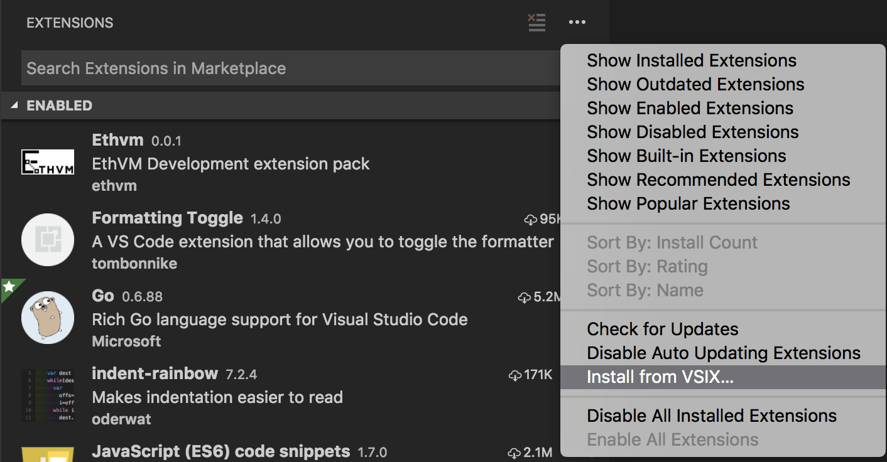

# Ethvm Extension pack

A collection of extensions for setting up your VSCode environment for Development of [Ethvm: Ethereum Blockchain Explorer](https://github.com/enKryptIO/ethvm)

### Extensions Included
* [Go for Visual Studio Code](https://marketplace.visualstudio.com/items?itemName=ms-vscode.Go)
* [Editorconfig](https://marketplace.visualstudio.com/items?itemName=EditorConfig.EditorConfig)
* [Vetur](https://marketplace.visualstudio.com/items?itemName=octref.vetur)
* [Docker](https://marketplace.visualstudio.com/items?itemName=PeterJausovec.vscode-docker)
* [ESLint](https://marketplace.visualstudio.com/items?itemName=dbaeumer.vscode-eslint)
* [ident-rainbow](https://marketplace.visualstudio.com/items?itemName=oderwat.indent-rainbow)
* [Prettier - Code formatter](https://marketplace.visualstudio.com/items?itemName=esbenp.prettier-vscode)
* [dotenv](https://marketplace.visualstudio.com/items?itemName=mikestead.dotenv)

## Installing Ethvm Extension Pack

### Step 1

Download  [ethvm.vsix](https://github.com/enKryptIO/ethvm-extension-pack/releases/download/0.0.1/ethvm-extension-pack.vsix)

### Step 2

Go to extension Tab in VSCode, from options press Install from vsix



This will install ethvm package extension into VSCode.

## Build from Source

### Step 1

Clone ethvm-extension-pack

```sh
$ git clone https://github.com/enKryptIO/ethvm-extension-pack/
```

### Step 2

Install vsce

```sh
yarn global add vsce
```

### Step 3

pack extension

```sh
vsce package
```

This will package extension into a .vsix file and place it in the current directory

## License

This project is licensed under the MIT License - see the [LICENSE](LICENSE) file for details.
